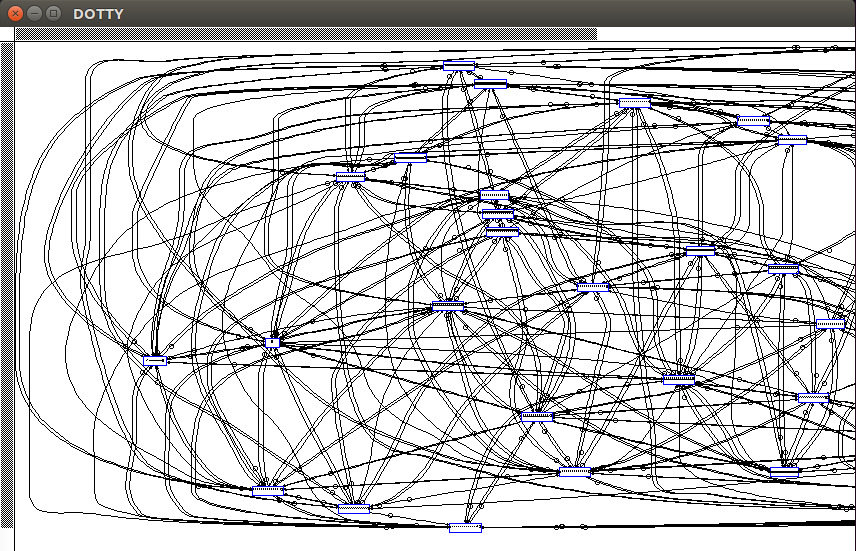

# What is kadsim ?

Kadsim is a kademlia simulator written in C++ strictly following the
implementation of Petar Maymounkov and David Mazières
[paper](https://pdos.csail.mit.edu/~petar/papers/maymounkov-kademlia-lncs.pdf)

> Kademlia: A Peer-to-peer Information System Based on the XOR Metric

The goal of this simulator is to test the inherent nature of the routing protocol and to make experiments.

# How to use it:

    $ make
    $ ./kadsim -h
    usage: kadsim
       -b       n_bits
       -k       Kademlia K parameter
       -a       Kademlia alpha parameter
       -n       number of nodes
       -c       initial number of connections per node
       -N       number of files
       -S       random seed
    $ ./kadsim -n 100 -k 5
    initialize files
    checking files                   
    file adfa681fd77852ae who was referenced by 30a3d70a3d70a3d4 was not found
    1/5000 files wrongly stored      
    kadsim> 

In the example above, a replication factor of 5 is not sufficient to
guarantee a 100% hit on 100 nodes.

# Dependencies

- [libjson-rpc-cpp](https://github.com/cinemast/libjson-rpc-cpp)
